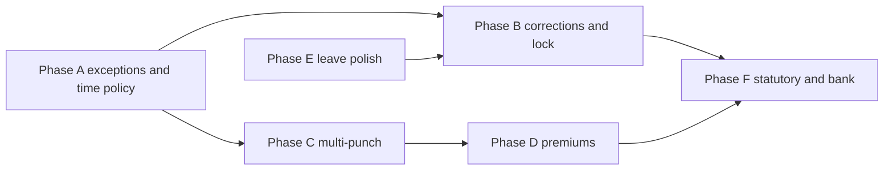

# Recommended Additional Features (PH Payroll)

This document suggests **future capabilities** that would strengthen PH Payroll beyond the areas already covered in [design-ph-compensation-tax-computation.md](./design-ph-compensation-tax-computation.md) and [design-13th-month-computation.md](./design-13th-month-computation.md). It is **not** a commitment to implement everything listed; use it for prioritization and product direction.

**Current baseline (timekeeping-related):** payroll daily logic uses **Time In** and **Time Out** (one pair per employee per date, with **Manual Attendance** as fallback), plus **Official Business** and **Leave** branches in `fetch_time_and_sales`. That model is simple and works for single-shift, single-site punch workflows; the recommendations below mostly **extend** or **harden** that foundation.

---

## 1. Timekeeping and attendance (high impact)

| Feature | Why it matters |
|--------|----------------|
| **Multiple punches per day** | Split shifts, lunch return, or “out for appointment” need more than one in/out pair. Options: child table of punches on one **Attendance** document, or multiple Time In/Out rows with sequence and pairing rules. |
| **Break and meal rules** | Auto-deduct unpaid break minutes from paid hours; configurable per branch or employment type (common in retail and BPO). |
| **Grace periods, rounding, and minimum billable** | Avoid penny-level disputes: e.g. round to nearest 15 minutes, grace 10 minutes late without deduction, minimum 4 hours if employee was called in. Store rules in **Payroll Settings** or **Branch**-level policy. |
| **Scheduled vs actual** | Link each day to an **expected shift** (start/end, rest days). Flag **undertime**, **late**, **early out**, and **no-show** before payroll runs. |
| **Night differential and holiday OT** | Philippines labor rules often distinguish ordinary day, rest day, special holiday, regular holiday, and night premium (e.g. 10pm–6am). Encode premiums as **configurable multipliers** or separate earning codes fed from attendance classification, not hard-coded in one function. |
| **Overtime authorization** | OT only counts if **approved** (manager flag or linked **Overtime Request**). Prevents payroll inflation and supports audit. |
| **Cross-midnight shifts** | Treat “night shift” as one logical workday even if Time Out is calendar next day; avoid double-count or zero-day bugs. |
| **Correction workflow** | Replace or supplement ad hoc edits with **Attendance Adjustment** requests (reason, approver, before/after times) so payroll uses submitted corrections and keeps an audit trail. |
| **Exception dashboard** | List “missing out punch”, “missing in”, “duplicate day”, “branch mismatch” for HR to clear before **Run Payroll**. |
| **Biometric / third-party import** | API or scheduled import from devices (ZK, etc.) mapping external employee IDs to **Employee**. Reduces reliance on mobile-only **Time In**/**Time Out**. |

---

## 2. Leave and time off (ties to payroll)

| Feature | Why it matters |
|--------|----------------|
| **Leave balances and accrual** | Track SL/VL (or company policy) per year; show balance on leave forms; optionally block leave when insufficient. |
| **Leave calendar and overlaps** | Team calendar, blackout dates, and validation for half-day vs full-day. |
| **Unpaid leave** | Distinct from paid leave in payroll: reduce basic or flag zero-pay days without breaking existing paid-leave paths. |

---

## 3. Payroll process and controls

| Feature | Why it matters |
|--------|----------------|
| **Payroll lock / period close** | After a period is “closed”, block edits to underlying attendance or require a controlled **reopen** role. |
| **Simulation or draft preview** | Run payroll in preview mode: totals and exceptions without saving vouchers (or save as cancelled draft). |
| **Retro and back-pay vouchers** | Structured **Special** run type for salary adjustments with explicit “period being corrected” metadata for reports. |
| **Bank file export** | Generate payment files in formats local banks expect (field layout per bank template). |

---

## 4. Statutory and reporting (Philippines)

| Feature | Why it matters |
|--------|----------------|
| **BIR Form 2316 / alphalist** | Mentioned as out of scope in the tax design doc; still a common **next** milestone once withholding is stable. |
| **SSS / PhilHealth / Pag-IBIG remittance reports** | Contribution registers per month, per employee, aligned with voucher submit dates. |
| **Government-mandated reports** | Templates or exports employers file periodically (exact scope depends on industry and legal updates—keep formats configurable). |

---

## 5. Employee and master data

| Feature | Why it matters |
|--------|----------------|
| **Cost center / project allocation** | If payroll items must split hours or amounts for accounting, add optional dimensions on **Payroll Item** or via integration to ERPNext **Accounting Dimension**. |
| **Document expiry** | Alerts for medical, contracts, or work permits tied to **Employee**. |
| **Onboarding checklist** | Standard tasks before first payroll (tax status, bank account, contribution flags). |

---

## 6. UX and self-service

| Feature | Why it matters |
|--------|----------------|
| **Mobile-first punch improvements** | Offline queue, clearer “you are not clocked in” state, optional geofence (with privacy policy). |
| **Employee payslip portal** | Read-only PDF or web view of submitted **Payroll Voucher** lines (with field-level permissions). |

---

## 7. Suggested prioritization (example)

1. **Exception reporting + attendance corrections** — lowers payroll errors with minimal schema change.  
2. **OT approval + configurable rounding/grace** — high dispute reduction.  
3. **Multiple punches / cross-midnight** — required for many real-world schedules.  
4. **Night diff / holiday premiums** — align pay rules with PH practice once base attendance is reliable.  
5. **Leave balances** — HR efficiency and fewer payroll adjustments.  
6. **Statutory exports (2316, remittance registers)** — after withholding and contributions are finalized in-product.

---

## 8. How this relates to existing designs

- **13th month** and **withholding tax** depend on **accurate Regular voucher history**; timekeeping quality directly affects **basic_pay**, **overtime_pay**, and **holiday_pay** totals that feed those designs.  
- Any new attendance entity (e.g. unified **Attendance** with child punches) should define a **clear mapping** to the existing **Payroll Item** fields so `populate_items` (or a successor) stays one obvious code path.

This file can be updated as features ship or priorities change.

---

## 9. Review vs current PH Payroll codebase

This section maps the recommendations to **what already exists** in the app (module `phpayroll.ph_payroll`) so planning is realistic.

### 9.1 Payroll computation spine

| Area | Current behavior | Implication for new work |
|------|------------------|---------------------------|
| **Daily loop** | `populate_items` in `payroll_voucher.py` walks each date in the voucher range and calls `fetch_time_and_sales`. | Any attendance change should either feed this function or replace it with a single resolver that still outputs compatible **Payroll Item** rows. |
| **Time path** | One **Time In** + one **Time Out** per employee per date (`get_value`); fallback to submitted **Manual Attendance** for missing punches. | Missing pair yields **zero** worked hours for that day unless corrected. Exception reports are high value **without** schema migration. |
| **Official Business / Leave** | Submitted **Official Business** and **Leave** short-circuit the time path; pay uses `basic_hours × number_of_days × hourly_rate` plus holiday premium. | Shift/schedule features must not break this ordering (OB → Leave → time). |
| **Basic / OT / holiday** | `fetch_cash_count_and_populate_items`: basic = `min(hours_worked, basic_hours) × hourly_rate`; holiday extra from `get_holiday_rate` (**Payroll Holiday**); OT hours = `min(sum(submitted Overtime hours), max(0, hours_worked - basic_hours))`; **overtime pay uses a fixed `1.25` multiplier**, not per-line **Overtime Type** rates. | “Configurable premiums” starts with **using existing Overtime Type / holiday rates consistently** before adding night diff / rest-day matrices. |
| **13th month / tax** | **Payroll Settings** includes 13th month components, income tax toggles, tax base table, annual tax table link; withholding lives in `tax/withholding.py` and is wired from `populate_items`. | Statutory exports (2316, alphalist) should wait until withholding rules are stable in production. |

### 9.2 Already partially covered recommendations

| Recommendation | Existing pieces | Gap |
|----------------|-----------------|-----|
| **Overtime authorization** | **Overtime** is submittable; payroll only includes `docstatus = 1`. Supervisor/Manager roles can submit. | Tighten who can **create** vs **submit** if needed; payroll ignores **Overtime Type.rate** for currency (see above). |
| **Leave balances** | **Leave Credits** (per employee) + **Leave Credit Line**; **Leave** `on_submit` consumes credits, `on_cancel` restores. | Accrual schedules, per–leave-type pools in UI, calendar/blackout, **unpaid** leave (no pay / no credit) may still be missing—confirm against `leave_credits.py` and **Leave Type**. |
| **Correction workflow** | **Manual Attendance** (submittable, reason field); time can be adjusted after the fact. | No dedicated “request → approve” naming; duplicates/conflicts with auto **Time In/Out** need clear rules (last wins, or block if machine punch exists). |

### 9.3 Not present (or only rudimentary)

- Multiple punches per day, break deductions, grace/rounding policies, shift templates, cross-midnight logical day.
- Central **attendance exception** report or payroll lock.
- Biometric import, payslip portal, bank export, BIR 2316/alphalist, SSS/PhilHealth/HDMF remittance file generators (beyond voucher data).

---

## 10. Suggested implementation plan

Phases are ordered to **maximize error reduction early** and to **avoid rewriting payroll twice**. Each phase lists primary deliverables and typical touchpoints.

### Phase A — Observability and policy hooks (low schema risk)

**Goal:** HR sees problems before **Run Payroll**; configurable rounding/grace without redesigning punches.

1. **Attendance / payroll exception report** (Script Report or DocType list + query report): for a branch and date range, flag rows where (a) no Time In/Out and no submitted Manual Attendance and no OB/Leave, (b) Time In without Time Out or reverse, (c) duplicate Time In/Out for same date, (d) optional branch mismatch vs voucher branch.  
   - *Code:* new report under `ph_payroll/report/`; reuse query patterns from `fetch_time_and_sales` in `payroll_voucher.py`.

2. **Payroll Settings (time policy)** — optional fields: grace minutes late, round worked hours to nearest N minutes, minimum paid hours (if any).  
   - *Code:* `payroll_settings.json` + apply in `calculate_hours_worked` or immediately after in `fetch_cash_count_and_populate_items`.

3. **Align OT pay with Overtime Type** — for each submitted **Overtime** line, compute pay using linked **Overtime Type** `rate` (or explicit line rate) instead of hardcoded `1.25`, with a Settings fallback if rate missing.  
   - *Code:* `fetch_overtime_hours` may become “fetch overtime segments” returning hours + rate; or post-process after SQL sum. Add tests in `test_payroll_voucher.py`.

**Exit criteria:** Report used in payroll cutover checklist; no regression on existing vouchers (golden tests for a few fixed dates).

### Phase B — Corrections and controls

**Goal:** Clear audit trail and less ad hoc data change.

1. **Attendance adjustment** (optional new submittable DocType) or formalize **Manual Attendance** as the only correction path with validation: cannot overlap OB/Leave without explicit override role.  
   - *Code:* `validate` on Manual Attendance or new doctype; server method used by report to show “pending corrections”.

2. **Payroll period lock** — Single or per-branch **Payroll Period** (or reuse **Payroll Book** if aligned): when closed, block `populate_items` / submit on vouchers whose dates fall in closed period unless role **Payroll Reopen**.  
   - *Code:* hook on `Payroll Voucher` validate/before_submit; small DocType or field on existing book.

3. **Draft payroll preview** — `run_payroll` flag `dry_run=1` returning JSON/HTML summary (totals, exception count) without saving—or save draft vouchers in a cancelled state (pick one pattern).  
   - *Code:* `payroll_voucher.py` `run_payroll` and/or `populate_items` refactor to support non-persisting path.

**Exit criteria:** HR can run “preview” for a period; locks prevent silent edits after sign-off.

### Phase C — Multi-punch and cross-midnight (structural)

**Goal:** Support split shifts and night shift without double-counting calendar days.

1. **Design choice:** either (i) new parent **Attendance** with child **Attendance Punch** rows, or (ii) allow multiple **Time In**/**Time Out** per day with sequence and pairing.  
   - Prefer (i) if you want one amendable document per logical day.

2. **Logical workday** field or rule set (e.g. shift starts 22:00 → belongs to “duty date” D).  
   - *Code:* new resolver `resolve_worked_hours(employee, duty_date, policy)` returning `hours_worked` + metadata; `fetch_time_and_sales` calls it instead of inline `get_value`.

3. **Break rules** — unpaid minutes deducted after gross duration is known.  
   - *Code:* policy on Branch or Payroll Settings; applied in resolver.

**Exit criteria:** Parity tests: old single-punch days match previous `populate_items` totals when policy is “none”.

### Phase D — Premium pay (Philippines-oriented)

**Goal:** Rest day / holiday / night differential beyond a single **Payroll Holiday** rate.

1. Extend **Payroll Holiday** or add **Premium Rule** child table: day type (ordinary, rest, special, regular holiday), time window, multiplier; or map hours buckets to **Payroll Item** fields (new columns if needed: e.g. `night_diff_pay`).  
2. **Integrate in** `fetch_cash_count_and_populate_items` **after** stable `hours_worked` from Phase C.  
3. Wire **tax base** and **13th month** component tables if new earnings must be includable or excludable.

**Exit criteria:** Documented examples (ordinary OT vs holiday OT vs night diff) with automated tests.

### Phase E — Leave and HR polish

1. **Unpaid leave** — **Leave Type** flag `paid` vs `unpaid`; payroll branch pays 0 basic for unpaid but keeps day as “excused”; optional negative adjustment.  
2. **Calendar / blackout** — validation on **Leave** save; optional **Team Leave Calendar** report.  
3. **Accrual** — scheduled job or **Leave Credit Line** bulk create from policy (annual grant, monthly accrual).

**Exit criteria:** Unpaid leave does not consume paid credits; accrual job idempotent per period.

### Phase F — Statutory and disbursement

1. **Contribution registers** — reports from submitted **Payroll Voucher** aggregating `ss_ee`, `ph_ee`, etc., by month.  
2. **BIR 2316 / alphalist** — separate mini-project: employee annual totals, previous employer data, CSV/XML per BIR specs.  
3. **Bank file** — template per bank (config table + export method).

**Exit criteria:** Finance sign-off on sample outputs for one tax year.

### Dependencies (summary)

### What to defer or skip unless required

- **Biometric import:** integrate only after Phase C stabilizes how a “day” is defined.  
- **Cost center / ERPNext dimensions:** add when accounting integration is scoped.  
- **Geofencing / offline punch:** product and privacy decision first; technical work follows Phase A mobile UX tweaks.

---

*Last updated: aligned with codebase review (payroll voucher daily loop, Leave Credits, submitted Overtime, Payroll Settings tax/13th month).*
